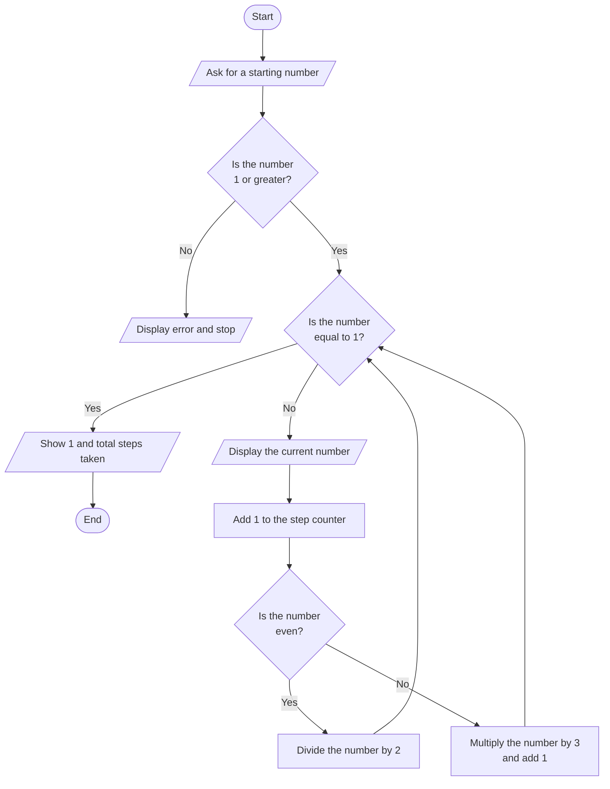

## The Collatz Conjecture

The Collatz conjecture or the $3n+1$ problem is one of those puzzles so simple that you can explain it to a five year old in a single sentence. Yet, almost a hundred years later, we still have not proved it.

### Introduction

Take any positive whole number, which we will denote as $n$. If the number is even, divide it by $2$. If the number is odd, multiply it by $3$ and add $1$.

$$
f(n) =
\begin{cases} 
\frac{n}{2} & \text{if } n \text{ is even} \\
3n + 1 & \text{if } n \text{ is odd}
\end{cases}
$$

Examples:
- $6$ is even, $6 \div 2 \rightarrow 3$
- $3$ is odd, $3 \cdot 3+1$ 
- $2$ is even, $2 \div 2 \rightarrow 1$
- $10$ is even, $10 \div 2 \rightarrow 5$
- $1$ is odd, $3 \cdot 1 + 1 \rightarrow 4$

Starting a relatively large number like $13$ we can make a chain of numbers $13 \rightarrow 40 \rightarrow 20 \rightarrow 10 \rightarrow 5 \rightarrow 16 \rightarrow 8 \rightarrow 4 \rightarrow 2 \rightarrow 1$. Something ineresting happens when we reach the number $4$: $4$ is even, so dividing by $2$ gives us $2$; $2$ is even so dividing by $2$ gives us $1$. Since $1$ is odd we multiply by $3$ and add $1$, reaching $4$ again then we end up at $1$ again.

The Collatz conjecture tells us that with any integer, eventually we will end up at $1$, which will just take us back to $4$, but then we end up at $1$ and are stuck in an infinite loop. Since there is an infinite number of integers, it's impossible to prove this by checking every number. But that hasn't stopped people from trying to brute-force this by checking as many numbers as possible.

### Implementation

Our goal is to create an algorithm that takes any integer input from the user, processes it through specific logic, and terminates at **1**. This is much simpler to describe than it is to implement.

**The basic logic is as follows:**
* **Input:** Ask the user for an integer.
* **Validation:** Verify that the input is a valid positive integer.
* **Main Loop:**
    * If the number is **even**, divide it by 2.
    * If the number is **odd**, multiply it by 3 and add 1.
* **Termination:** Repeat this process until the sequence reaches 1.

Below, you can find a flowchart of the core logic.

You can also view the complete source code by following the links below:
* [Rust Source Code](rust-projects/collatz_conjecture_rust/src/main.rs)
* [C++ Source Code](cpp-projects/collatz_conjecture_cpp/collatz_conjecture.cpp)

